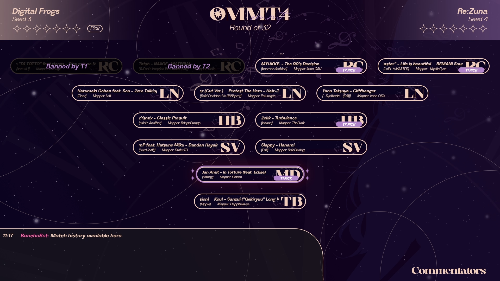

# ommt24-streamOverlay
The main repository for the overlay of osu! Malaysia Mania Tournament 2024, meant to run on tosu
___

### OBS Scene
The scene file is located in `ommt24-streamOverlay/_data/`. The JSON file will be named **ommt24_obs_vX.X** in the directory. Just pick the one with the latest version when importing into OBS

After importing the scene file, you should be prompted with a Missing Files tab.


Click on "Search Directory..." and select the `_shared_assets` folder in the project files. If it doesn't fully link all the missing files, try selecting the subfolders in the `_shared_assets` folder. After that, just click on Apply and the assets should be displayed.

### Tosu & Stream Directory
**[Project link for tosu](https://github.com/KotRikD/tosu#readme)**

To install the application, just download the latest release and export `tosu.exe` in whatever directory you want. Then in that same directory, create a static file and run `tosu.exe`.

To properly import all overlays, download the latest release of this project and import it into the static folder. If you have an osu! client open, the OBS scenes should properly reflect the scenes. If there's any issue projecting the overlay on OBS, you can try finding the URL link of the individual overlays by scrolling down to the target overlay and clicking on the URL parameter.

If you open the link in the browser and it doesn't project anything, contact louscmh immediately. If not, then OBS should be able to project the browser source.

### Setting up `beatmaps.json`
The JSON file contains 4 variables:
- `beatmapId`: the id of your beatmap, as displayed in the URL of the beatmap link (beatmapsets/2019194#taiko/***4204844***)
- `pick`: the pick name of your beatmap (RC1, LN2, TB, etc.). This overlay supports the following mods: RC, LN, HB, SV, MD, TB.

***(NOTE FOR CUSTOM MAPS)*** As unreleased maps have no beatmapId, the beatmapId will be substituted with the map's file name instead. Replace the `beatmapId` parameter with a string following this format: `Arist - Song Title (Mapper Name) [Difficulty].osu`

- `Artist`: The **ROMANIZED** name of the Artist of the song (ex: `Null Specification`)
- `Song Title`: The **ROMANIZED** name of the song (ex: `Aletheia (fake love, fake summer)`)
- `Mapper Name`: The name of the mapper associated with the beatmap (ex: `Rinze`)
- `Difficulty`: The difficulty name of the beatmap (ex: `fake promise`)

Combining all examples of the arguments, you will get `Null Specification - Aletheia (fake lover, fake summer) (Rinze) [fake promise].osu`. The string is **Case** and **Space** sensitive.

This must be updated **every week** to reflect the changes in-stream and must be distributed to the person streaming the showcase overlay.

A sample example of the JSON is included as follows:
```json
[
    { "beatmapId": 2917081, "pick": "RC1"},
    { "beatmapId": 4682349, "pick": "RC2"},
    { "beatmapId": 1215562, "pick": "MD"},
    { "beatmapId": 4590142, "pick": "RC4"},
    { "beatmapId": 1948492, "pick": "RC5"},
    { "beatmapId": 4597084, "pick": "LN1"},
    { "beatmapId": 3960091, "pick": "LN2"},
    { "beatmapId": 4236227, "pick": "LN3"},
    { "beatmapId": 2576768, "pick": "HB1"},
    { "beatmapId": 3440474, "pick": "HB2"},
    { "beatmapId": 4682297, "pick": "SV1"},
    { "beatmapId": 2329945, "pick": "SV2"},
    { "beatmapId": "Null Specification - Aletheia (fake lover, fake summer) (Rinze) [fake promise].osu", "pick": "TB"}
]
```

### Commentator Overlay
In numerous scenes, there will be an overlay for the commentators in their own scene respectively. Click on the commentator overlay, and add both the server id that contains the voice channel you are in, and the voice channel id that you are streaming in into the URL. (This requires you to turn on Developer Mode in Discord!)


If you don't plan to talk at all, you can do this to hide yourself in vc indicator:
1. Right click on yourself in discord, Copy ID.
2. Put your ID into the following code: `li[data-userid*="your user id here"] {display: none;}`
3. Paste this code at the end of the respective commentator overlay's custom CSS.

### Mappool Overlay
Example scene for reference


**IMPORTANT SETUP STEP**
The showcase overlay uses the following JSON to function:
- `beatmaps.json`
- `api.json`
- `seeds.json`

For the mappool overlay to properly function & display both player & beatmap details, it will require you to insert an API key into `_data/api.json`.

You can find your own osu! API at old.ppy.sh/p/api (wait for awhile after logging in!), make sure to not reveal this api key to anyone else (otherwise they will have the potential to steal your credentials)

Within the Mappool Overlay there are a few interactable elemenets that requires the streamer to manually click on them to properly display what is being picked, who is it being picked by, moving on to the next map etc. To interact with the Overlay, click on the `Interact` Button when selecting the Mappool Overlay in OBS.


**INTERACTING WITH THE BEATMAPS**


While hovering on any of the beatmaps,
- Left Click to pick for **Team 1**
- Right Click to pick for **Team 2**
- Shift + Left Click to ban for **Team 1** (Note: there can only be 2 banned maps in the overlay at once! (as per the tourney rules))
- Shift + Right Click to ban for **Team 2** (Note: there can only be 2 banned maps in the overlay at once! (as per the tourney rules))
- Ctrl + Left Click to retract any actions (This will retract the pulsing pick aswell)

**INTERACTING WITH THE CONTROL PANEL**


In order from left to right:
____
- **SCENE BUTTON**: Has 2 modes: `MAPPOOL` (default) and `GAMEPLAY`. When clicking on this button, the `MAPPOOL` scene above will change to show the `GAMEPLAY` below and vice versa (try this on obs to actually see it!). **This will automatically trigger by itself once both players enter the map, and will automatically trigger again 15 seconds after the results screen has been shown. (if you switch manually before then nothing happens)**
____
- **TURN BUTTON**: Has 3 modes: `NOT AVAILABLE` (default), `TEAM 1` and `TEAM 2`. In `NOT AVAILABLE` mode, clicking on the button will do nothing, as you will require to ban 2 maps before being able to interact with it. Once you banned 2 maps, the button will switch to either `TEAM 1` or `TEAM 2` depending on which team bans the 2nd map (indicating they also go first). Upon clicking the button in any of the 2 aforementioned modes will switch the mode to the other team. This concerns how the `AUTOPICK BUTTON` functions. **This will automatically trigger by itself once result screen has been shown, moving on to the next team's turn. (This will retract the pulsing pick aswell)**
____
- **AUTOPICK BUTTON**: Has 2 modes: `OFF` (default) and `ON`. When turned to `ON`, whenever the client switches to any map in the pool, the overlay will automatically detect the map and pick it based on which team is showing on the `TURN BUTTON`. So for example if it is currently `TEAM 2`'s turn to pick and they pick `RC2`, upon changing the map in the client the overlay will automatically pick `RC2` for you. This will only toggle if the following conditions has been satisfied:
    - There is 2 banned maps in the overlay
    - The `AUTOPICK BUTTON` has been toggle `ON`
    - From the moment the button has been turned on, a new map **that is part of the pool** has been switched to in the MP.

### Match Overlay
Example scene for reference


### Winner Overlay
Example scene for reference
